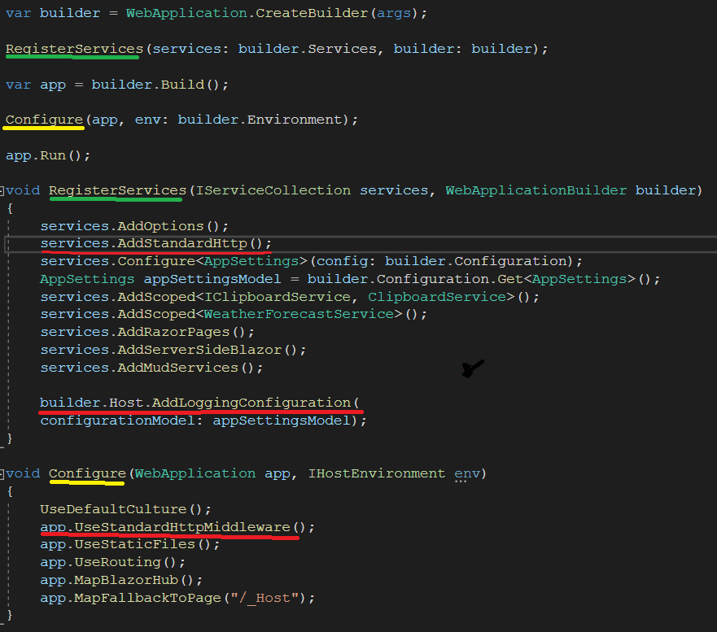
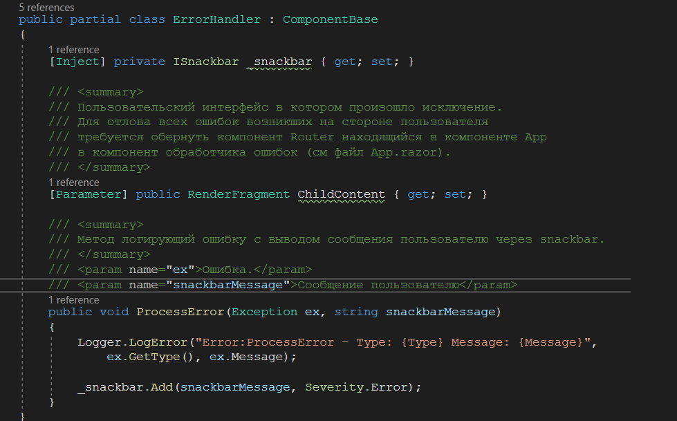
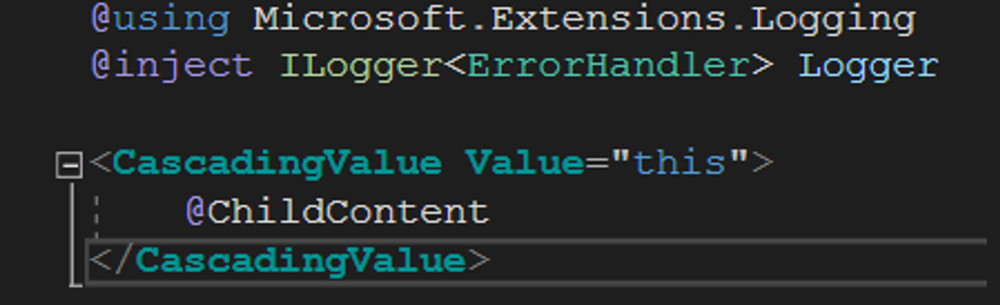
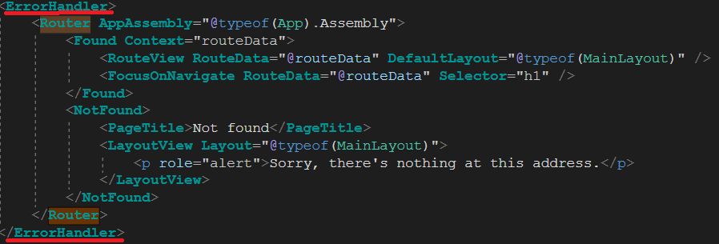
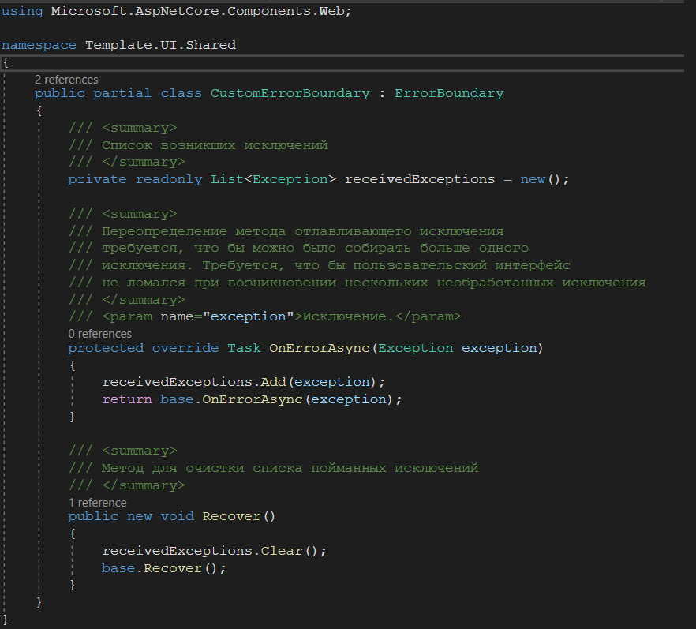
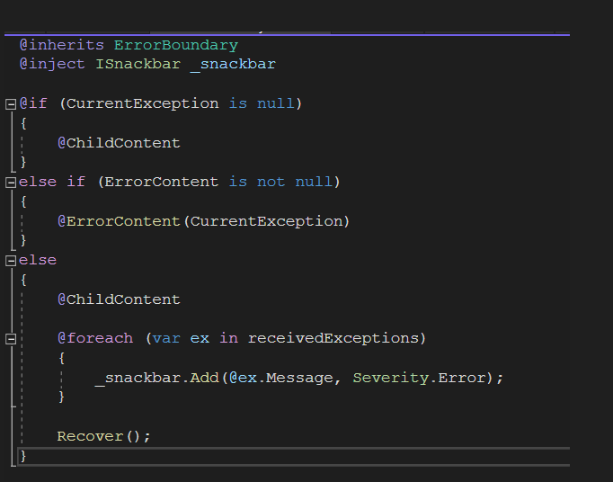
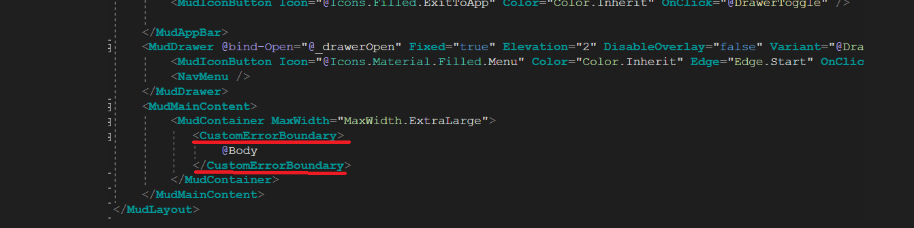

# Template

## Summary

*Краткое общее описание работы сервиса, для чего он нужен.
Описание взаимодействия с другими системами или модулями.
Ссылка на автодоку.*

Репозиторий с шаблоном, является примером.

API сервис, основной шлюз работы с сервисом.

Админка, реализующая варинаты манипуляций с пользователями и правами пользователей AD

Все интерфейсы взаимодействия описаны в Open API <xref:Template.App.Repositories.DbRepository.#ctor(Microsoft.EntityFrameworkCore.DbContextOptions{Template.App.Repositories.DbRepository})>

Пример использования токена обновления
[!code-csharp[Main](src/Program.cs#L1-L5 "This is source file")]

> [!WARNING]
>     Для работы с серивисом необходимо подключить nuget Authorization.Client 
>     Проект с клиентом, содержит классы и интерфейсы сгенерированные на основе Swagger файла 

## Settings

*Описание, администрирование и настройка
Конфигурационный файл
Какие настройки есть, где найти, как запустить/остановить
Где и как проверить, что сервис работает*

Поля конфигурации описаны тут <xref:Authorization.WebApi.AppSettings>
с форматами строк соединений <xref:Authorization.WebApi.AppSettings.ConnectionStrings>
> [!NOTE]
> DevOps конфигурация для каждой среды может иметь уникальное значение {Environment}

### [DevOps](#tab/devops)

appsettings.Production.json
[!code[appsettings.Development](src/Template.App/appsettings.Development.json)]

### [Global](#tab/global)

appsettings.json
[!code[appsettings](src/Authorization.Admin/appsettings.json)]

***

> [!CAUTION]
> Замену в глобальную конфигурацию вносить только в исходных файлах.

## Errors
*Описание, причины и место возникновения ошибки, варианты реагирования на ошибку*

| Описание  | Место возникновения | Условия возникновения | Требуемые действия
|----------|:-------------|:-------------|:-------------|
|Ошибка чего	|Стэктрейс ошибки	|Условия возникновения	|Какие действия необходимо предпринять
|<xref:Authorization.Domain.Base.BusinessException>: Не найдено ни одной политики| <xref:Authorization.Admin.Controllers.RightUIController.GetPolicies> | Политик нет | Первичное заполнение политик происходит автоматически, проверить БД

## Logging in ui

1. Подключаем и настраиваем [Serilog](http://docpo2.ru/doku.php?id=%D0%BE%D1%82%D0%B4%D0%B5%D0%BB%D1%8B:%D1%81%D0%B5%D1%80%D0%B2%D0%B8%D1%81%D1%8B:standart:%D0%BB%D0%BE%D0%B3%D0%B8%D1%80%D0%BE%D0%B2%D0%B0%D0%BD%D0%B8%D0%B5)
   Все сервисы и Middleware подключаем в классе Program 

   

2. Добавляем компонент обработчика ошибок <xref:Template.UI.Shared.ErrorHandler>
   В ErrorHandler.cs использован компонент Snackbar для вывода сообщений об ошибках пользователю. 

   

   Параметр RenderFragment ChildContent - содержит в себе часть пользовательского интерфейса в которой произошла ошибка.

   

3. В компоненте App создаем программу-оболочку для компонента Router с помощью компонента <xref:Template.UI.Shared.ErrorHandler>

   

   Благодаря этому компонент <xref:Template.UI.Shared.ErrorHandler> сможет переходить к любому компоненту приложения, в котором компонент <xref:Template.UI.Shared.ErrorHandler>
   получен как CascadingParameter

4. Добавляем компонент <xref:Template.UI.Shared.CustomErrorBoundary> наследуемый от компонента ErrorBoundary и в нем переопределяем
   метод OnErrorAsync. Метод базового компонента не способен обрабатывать более одной ошибки за раз в следствии, чего происходит поломка
   пользовательского интерфейса если одновременно произойдет более одного исключения.

   

   Параметр reseivedExceptions собирает исключения попадающие в метод OnErrorAsync, после чего ошибки обрабатываются в переопределенном компоненте ErrorBoundary

   

5. В компоненте MainLayout создаем программу-оболочку для компонента Body с помощью компонента <xref:Template.UI.Shared.CustomErrorBoundary>.
   Компонент <xref:Template.UI.Shared.CustomErrorBoundary> предотвращает поломку UI в случае возникновения необработанного исключения
   и возвращает пользователю сообщение об ошибке через всплывающее окно

   

6. Компонент <xref:Template.UI.Components.Auto> используется для генерации исключений. К событию нажатия кнопки edit(в таблице списка авто)
   привязан метод с инструкцией throw new InvalidOperationException();, К событию нажатия кнопки delete -
   привязан аналогичный метод, но генерируемое исключение помещено в конструкцию try/catch где в блоке catch происходит обработка
   данного исключения с помощью метода ProcessError компонента <xref:Template.UI.Shared.ErrorHandler>
   Сообщения об ошибках можно посмотреть в seq
